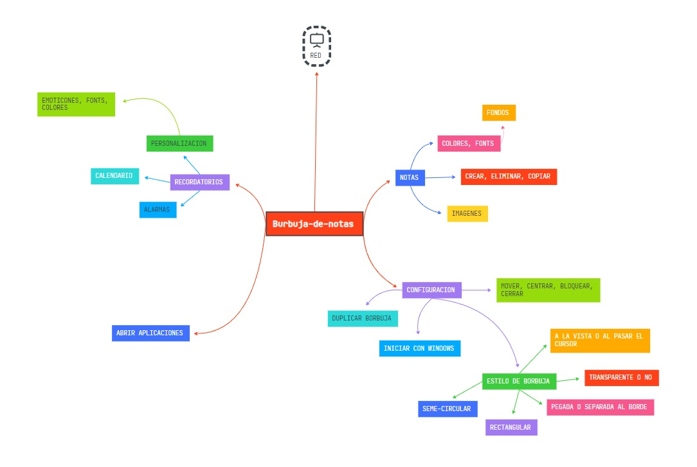

# 📝 Burbuja De Notas

**Burbuja De Notas** es un widget flotante multifuncional desarrollado en **C#** utilizando **.NET WPF**. La aplicación tiene como objetivo ofrecer una solución minimalista y eficaz para la gestión de notas, recordatorios y acceso rápido a otras aplicaciones desde el escritorio.

## 🌟 Funcionalidades principales

### 1. Gestión de notas 📋

- Crear, modificar y eliminar notas fácilmente.
- Personalización avanzada de las notas: colores, formato de texto, imágenes, y más.

### 2. Recordatorios y alarmas ⏰

- Configuración de recordatorios con alarmas visuales y sonoras.
- Integración de un calendario para eventos y fechas importantes.

### 3. Acceso rápido a aplicaciones 🔗

- Lanzamiento de aplicaciones comunes como **Outlook**, **Xbox**, **Spotify**, y otras directamente desde el widget.
- Interfaz amigable y personalizable para que el usuario configure sus accesos directos favoritos.

### 5. Personalización 🎨

- Cambia la apariencia del widget a tu gusto: bordes redondeados, colores, tamaños y más.
- Configuración avanzada para adaptar el widget a tus necesidades diarias.

## 🚀 Tecnologías utilizadas

- **C#**
- **.NET WPF**
- **XAML**

## 🌱 Estado actual del proyecto

Este proyecto se encuentra en fase inicial de desarrollo, enfocado principalmente en la creación del widget flotante y la implementación de las funcionalidades básicas.

## 🗺️ Mapa mental del proyecto

A continuación se muestra el mapa mental del proyecto con las funcionalidades y planes a futuro:

## 🛠️ Funcionalidades a futuro

- [ ] Mini reproductor de **spotify** avanzado para controlar tu música sin cambiar de ventana.
- [ ] Integración con más aplicaciones y servicios.
- [ ] Mejoras en la experiencia de usuario (UX/UI).
- [ ] Sincronización con la nube para respaldo de notas y eventos.

## 💻 Capturas de pantalla

_En construcción_

## 📄 Licencia

Este proyecto está bajo la Licencia MIT.

---

¡Gracias por revisar **Burbuja De Notas**! Esperamos que este proyecto sea una gran adición a nuestro portafolio y una herramienta útil para el día a día.
